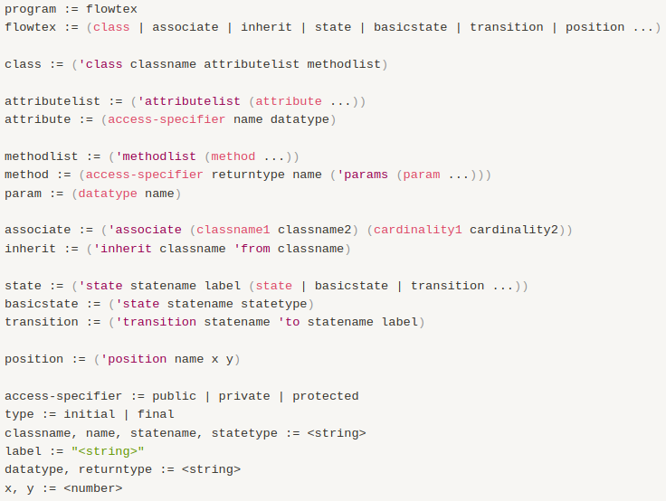
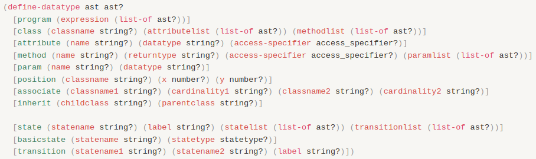
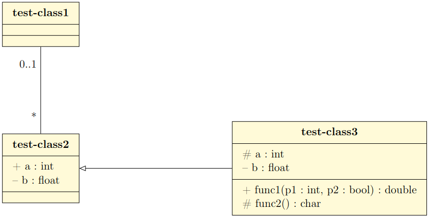
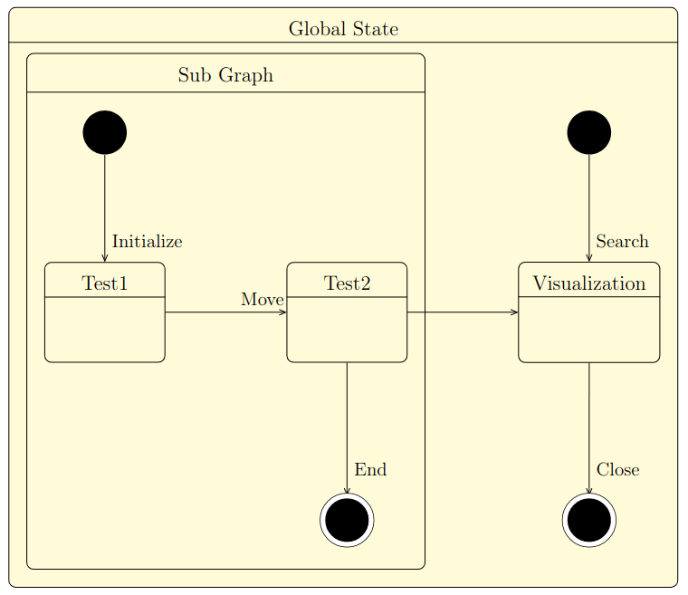

# FlowTex

## Code organization

- Driver code and command-line argument parser is present in [main.rkt](./src/main.rkt).
- Code for defining the abstract syntax is present in [ast.rkt](./src/ast.rkt).
- Code for the parser is present in [parser.rkt](./src/parser.rkt).
- Code for the evaluator is present in [evaluator.rkt](./src/evaluator.rkt).
- Code that sets up the entire pipeline is present in [create-uml.rkt](./src/create-uml.rkt).
- All code related to testing the DSL is present in [test.rkt](./src/test.rkt)

## How to Run

Run `racket main.rkt <infile> <outfile>` where:

- `infile`: path to file containing the program (concrete syntax).
- `outfile`: path to file where the output of the DSL should be written.

One can also run `create-uml <infile> <outfile>` in the DrRacket command prompt after opening [create-uml.rkt](./src/create-uml.rkt).

## Running tests

The `tests` directory has `3` subdirectories: `input`, `output` and `gt-output`.

- The `input` directory contains test programs.
- The `output` directory is where the DSL output will be written when running these programs.
- The `gt-output` directory contains the ground-truth output which will be compared to the DSL's generated output.

To add a new test:

- Add a new file to the `input` directory.
- Add a corresponding output file to the `output` directory.
- Add a corresponding ground-truth output file to the `gt-output` directory, containing the correct output of the test added.
- In `test.rkt`, add a new test case using the above three paths in the `ts-alltests` test suite.

## DSL Input and Output

### Concrete syntax



### Abstract syntax



### Sample Program (DSL Input): UML Class Diagram

```
(flowtex
  (class test-class1)

  (class test-class2
	  (attributelist (public int a) (private float b)))

  (class test-class3
  	(attributelist (protected int a) (private float b))
	  (methodlist (public double func1 (params (int p1) (bool p2)))
                (protected char func2 (params))))

  (associate (test-class1 test-class2) (0..1 *))

  (inherit test-class3 from test-class2)

  (position test-class2 0 -5)
  (position test-class3 10 -5))
```

### Sample DSL output: UML Class Diagram

```
\begin{tikzpicture}
\umlclass[x=0,y=0]{test-class1}
{
}
{
}
\umlclass[x=0,y=-5]{test-class2}
{
+ a : int \\
-- b : float \\
}
{
}
\umlclass[x=10,y=-5]{test-class3}
{
\# a : int \\
-- b : float \\
}
{
+ func1(p1 : int, p2 : bool) : double \\
\# func2() : char \\
}
\umlassoc[mult1=0..1, mult2=*]{test-class1}{test-class2}
\umlinherit{test-class3}{test-class2}
\end{tikzpicture}
```



### Sample Program (DSL Input): UML State Diagram

```
(flowtex
  (state Amain "Global State"

    (state Bgraph "Sub Graph"
      (basicstate Binit initial)
      (state test1 "Test1")
      (state test2 "Test2")
      (basicstate Bfinal final)

      (transition test1 to test2 "Move")
      (transition Binit to test1 "Initialize")
      (transition test2 to Bfinal "End"))

  (basicstate Ainit initial)
  (basicstate Afinal final)
  (state visu "Visualization"))

  (transition Ainit to visu "Search")
  (transition test2 to visu "")
  (transition visu to Afinal "Close")

  (position test1 0 -4)
  (position test2 5 -4)
  (position Bfinal 5 -8)
  (position Ainit 10 0)
  (position Afinal 10 -8)
  (position visu 10 -4))
```

### Sample DSL output: UML State Diagram

```
\begin{tikzpicture}
\begin{umlstate}[x=0,y=0,name=Amain]{Global State}
\begin{umlstate}[x=0,y=0,name=Bgraph]{Sub Graph}
\umlstateinitial[x=0,y=0,name=Binit]
\umlbasicstate[x=0,y=-4,name=test1]{Test1}
\umlbasicstate[x=5,y=-4,name=test2]{Test2}
\umlstatefinal[x=5,y=-8,name=Bfinal]
\umltrans[arg=Move]{test1}{test2}
\umltrans[arg=Initialize]{Binit}{test1}
\umltrans[arg=End]{test2}{Bfinal}
\end{umlstate}
\umlstateinitial[x=10,y=0,name=Ainit]
\umlstatefinal[x=10,y=-8,name=Afinal]
\umlbasicstate[x=10,y=-4,name=visu]{Visualization}
\end{umlstate}
\umltrans[arg=Search]{Ainit}{visu}
\umltrans[arg=]{test2}{visu}
\umltrans[arg=Close]{visu}{Afinal}
\end{tikzpicture}
```


